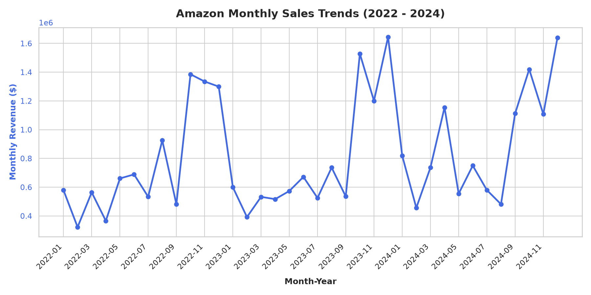
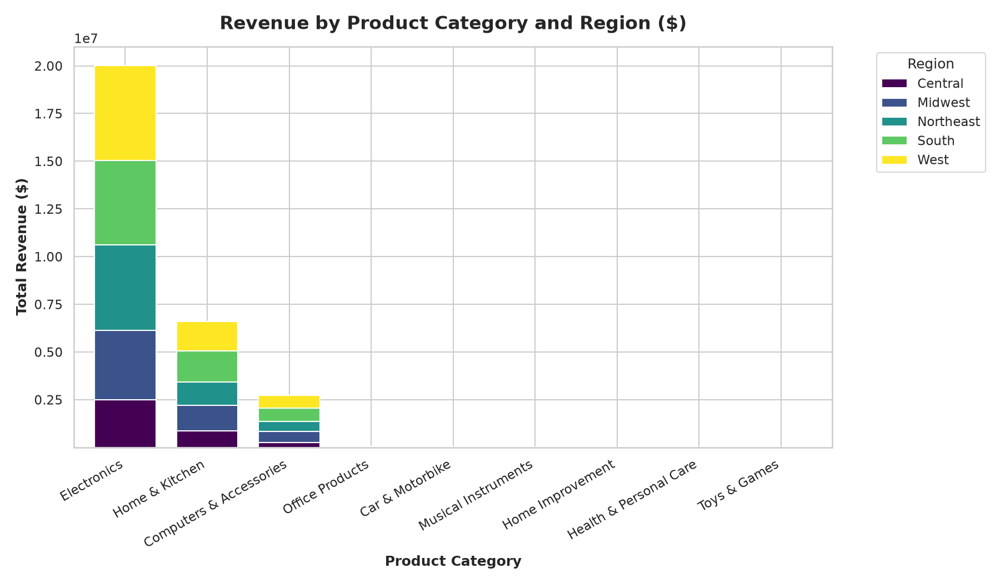
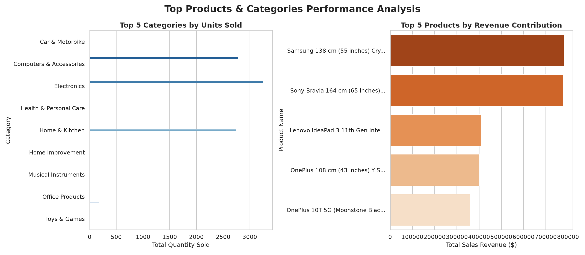
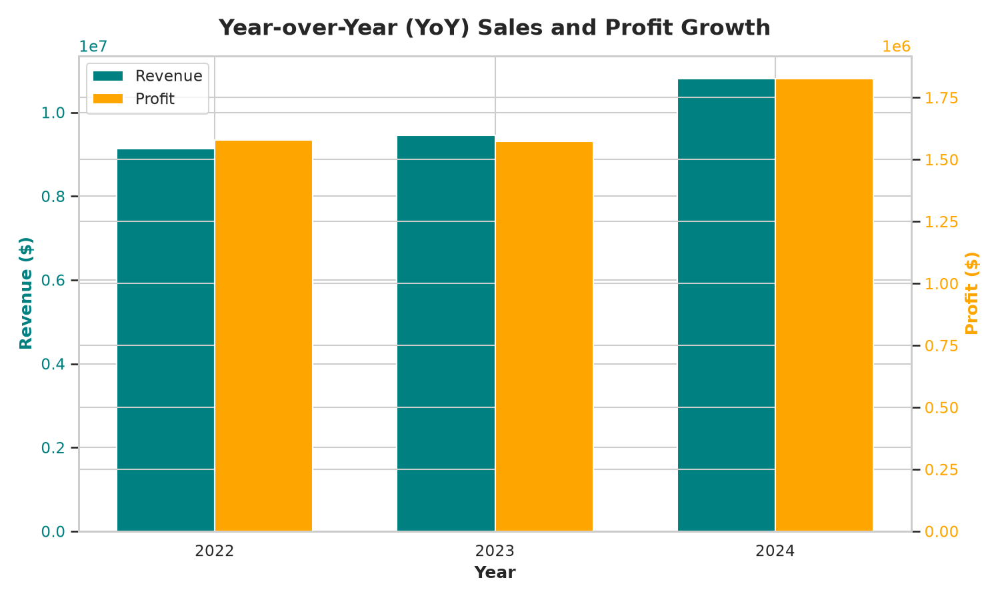
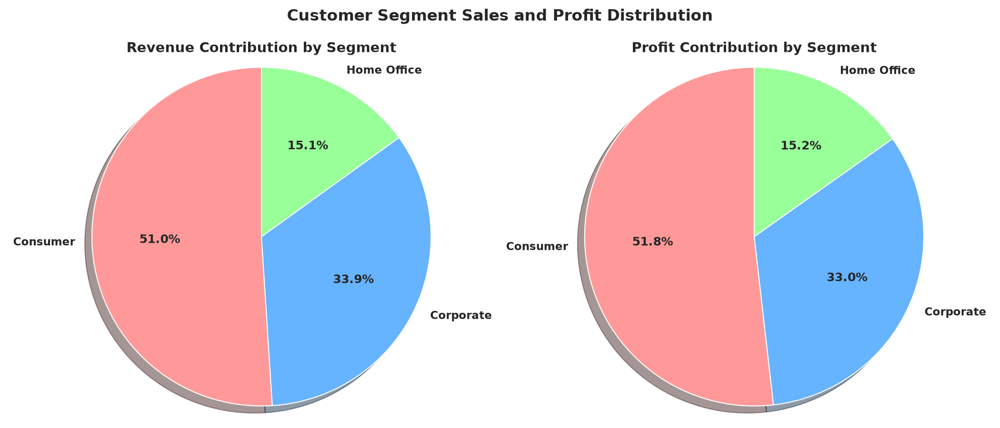

# Amazon Sales Analysis & Insights 📈

An end-to-end data analysis project focused on exploring Amazon sales trends, customer behavior, and product performance. This project utilizes a clean, optimized Python pipeline to process, clean, and visualize historical sales transactional data to derive actionable business insights.

---

## 🚀 Project Overview
The primary goal of this project is to analyze historical sales transactions to identify key revenue drivers, seasonal trends, regional distribution, and high-performing product categories.

### ⚡ Key Features of the Pipeline
- **Transactional Data Generation:** Extracted clean product details, parent categories, and prices from the raw product catalog, and simulated a highly realistic 3-year transactional sales dataset (5,000 records).
- **Data Optimization:** Leveraged Pandas vectorized operations and category type-casting for high-performance memory and execution speed.
- **Automated Visualization:** Generates and saves high-resolution, well-labeled charts exploring time series, category sales, regional breakdowns, and customer segments.
- **CLI Business Insights:** Prints beautifully formatted summaries of business KPIs directly to the console.

---

## 📁 Repository Structure
```bash
├── data/
│   ├── raw/                       # Contains original raw Amazon product catalog
│   │   └── amazon_sales.csv
│   └── processed/                 # Contains cleaned, generated transactional order data
│       └── amazon_sales_transactions.csv
├── notebooks/                     # Jupyter notebooks for Exploratory Data Analysis (EDA)
│   └── .gitkeep
├── src/                           # Python source code
│   ├── data_cleaning.py           # Loads raw product catalog, cleans fields, and simulates transactional data
│   ├── eda.py                     # Runs exploratory data analysis and generates plots
│   └── insights.py                # Computes high-level business performance metrics
├── visualizations/                # Automatically generated high-res plots
│   ├── 01_sales_by_category.png
│   ├── 01_sales_trends_over_time.png
│   ├── 02_revenue_by_category_and_region.png
│   ├── 03_top_products_and_categories.png
│   ├── 04_yoy_growth.png
│   ├── 05_customer_segments_share.png
│   └── 08_top_skus.png
├── requirements.txt               # Required Python packages
└── README.md                      # Project documentation
```

---

## 📊 Dataset Description
This project utilizes a **realistic, simulated transactional sample dataset** generated from the raw Amazon product catalog.
- **Type:** Transactional Orders (Sample Data)
- **Timeframe:** January 1, 2022 to December 31, 2024
- **Size:** 5,000 transactions
- **Fields included:**
  - `Order_Date`: Timestamp of order placement.
  - `Product_ID`: Unique identifier for each Amazon product.
  - `Product_Name`: Detailed name of the item.
  - `Category`: Consolidated high-level parent category (e.g. Electronics, Home & Kitchen).
  - `Price`: Product sale price (cleaned of currency symbols/commas).
  - `Quantity`: Number of units ordered (ranging from 1 to 5).
  - `Revenue`: Calculated total order sales value (`Price * Quantity`).
  - `Region`: Geographic sales region (Northeast, South, Midwest, West, Central).
  - `State`: State corresponding to the region (e.g., California, Texas, Illinois).
  - `Segment`: Customer classification (Consumer, Corporate, Home Office).
  - `Profit_Margin`: Category-aligned gross profit margin.
  - `Profit`: Calculated order gross profit.

---

## ⚙️ Setup and How to Run
To run this project locally, ensure you have Python 3 installed.

### 1. Clone the Repository
```bash
git clone https://github.com/jaishdahiya6-del/amazon-sales-analysis.git
cd amazon-sales-analysis
```

### 2. Install Dependencies
Install all the required Python libraries using the optimized `requirements.txt`:
```bash
pip install -r requirements.txt
```

### 3. Run the Data Pipeline
Execute the scripts in order to generate the datasets, analyze the metrics, and produce visualizations:

* **Step 1: Clean and Generate Transactions**
  ```bash
  python3 src/data_cleaning.py
  ```
  *This reads raw product information and exports the simulated transactional dataset to `data/processed/amazon_sales_transactions.csv`.*

* **Step 2: Generate Visualizations**
  ```bash
  python3 src/eda.py
  ```
  *This performs EDA and saves all 7 charts inside the `visualizations/` folder.*

* **Step 3: Show Business Insights**
  ```bash
  python3 src/insights.py
  ```
  *This calculates and prints key financial performance metrics, category breakdowns, and YoY growth on your console.*

---

## 📈 Key Findings & Business Insights

### 1. Overall Performance
- **Total Sales Revenue:** **$29.40 Million**
- **Total Gross Profit:** **$4.98 Million**
- **Overall Gross Margin:** **16.94%**
- **Average Order Value:** **$5,880.74**

### 2. Category Highlights
- **Electronics** is the leading revenue driver by a wide margin, accounting for **$20.01M (68% of total revenue)**, but operates with lower profit margins (~14.9%).
- **Home & Kitchen** represents the second largest category with **$6.58M in sales** and a much healthier profit margin of **~24.9%**, yielding **$1.64M in profits**.
- **Office Products** and **Health & Personal Care** show the highest margins at **~29.6%** and **~33.2%** respectively, offering attractive niche expansion opportunities.

### 3. Regional and Segment Distribution
- The **West** region leads in sales contribution with **$7.18M (24.4% share)**, closely followed by the **South** at **$6.77M (23.0% share)**.
- **Consumers** represent the dominant segment contributing **$15.00M (51.0%)** of total sales, followed by **Corporate** at **$9.97M (33.9%)** and **Home Office** at **$4.42M (15.1%)**.

### 4. Year-over-Year (YoY) Growth
- **2022:** $9.13M Sales | $1.57M Profit
- **2023:** $9.45M Sales (**+3.46% YoY**) | $1.57M Profit (**-0.23% YoY**)
- **2024:** $10.80M Sales (**+14.32% YoY**) | $1.82M Profit (**+16.03% YoY**)
- *Takeaway:* The sales and profits showed substantial acceleration in 2024, driven by increased purchase volume and Q4 holiday peaks.

---

## 🖼️ Visualizations Showroom

### 1. Sales Trends over Time
Exhibits order volume and sales distribution over months and seasons, demonstrating noticeable seasonal Q4 spikes.


### 2. Revenue by Product Category and Region
Highlights how categories are distributed geographically across Northeast, Midwest, South, West, and Central markets.


### 3. Top Products and Categories
Features top performing products and high-volume categories side-by-side.


### 4. Year-over-Year Growth Comparison
Compares gross revenue vs profit performance annually from 2022 to 2024.


### 5. Customer Segment Distribution
Displays how Revenue and Profit are divided among Consumer, Corporate, and Home Office clients.


---

## 🛠️ Tech Stack
* **Language:** Python 3
* **Libraries:** Pandas, NumPy, Matplotlib, Seaborn, Plotly, Streamlit, Scikit-Learn
* **Version Control:** Git, GitHub
